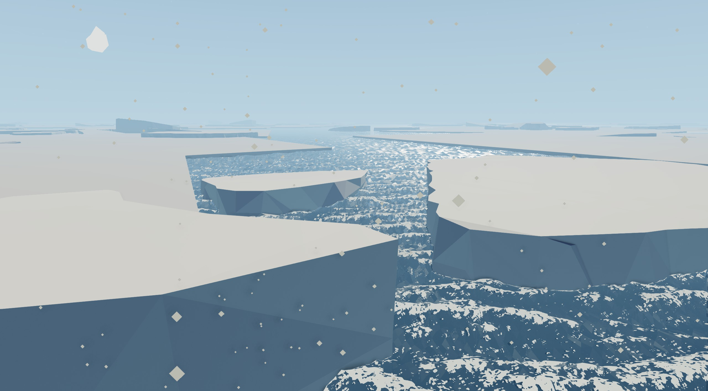
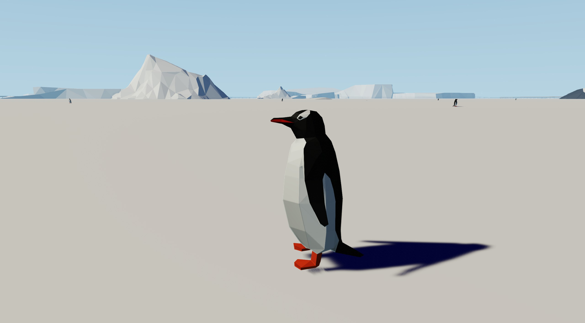
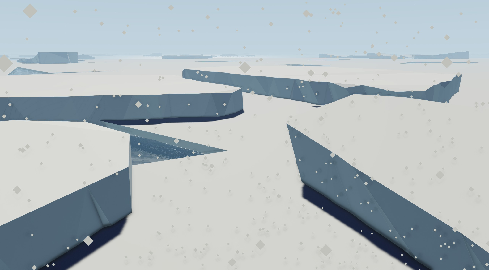
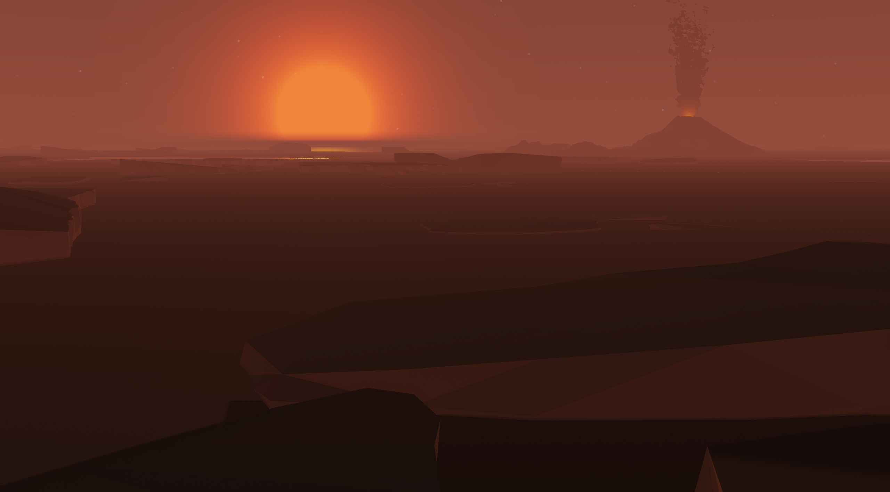
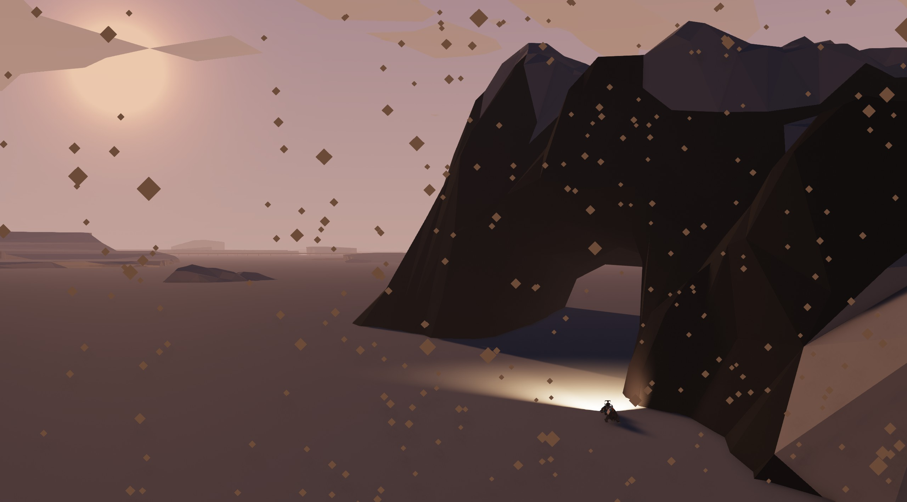
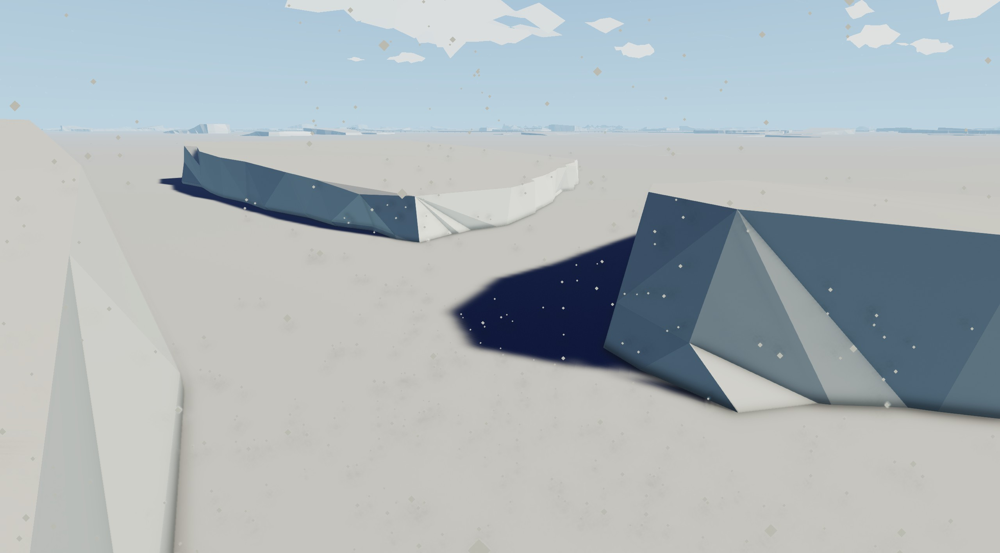

# Arctic Ice Pack

Adds a large walkable ice pack to the arctic ocean in **Stormworks: Build and Rescue**. Walk, drive vehicles, and land aircraft on top of it. Dive underneath with a submarine. The ice is made of overlapping irregular polygon slabs (pentagons, trapezoids, squares) for a natural low-poly look.

> **This mod is experimental.** It directly modifies game files and may cause issues in existing saves and new saves alike. Use at your own risk. Always keep a backup.

If you enjoy this mod, consider supporting on [Patreon](https://www.patreon.com/join/reysn) – I also make Stormworks video content and workshop creations.

---

## Screenshots

<table>
<tr>
  <td></td>
  <td></td>
</tr>
<tr>
  <td></td>
  <td></td>
</tr>
<tr>
  <td></td>
  <td></td>
</tr>
</table>

---

## Install (Simple)

> **Note:** The simple install requires pre-patched game tile files. Permission to distribute these files has been requested from Geometa Ltd. Until permission is granted, please use the [technical install](#for-technical-users) method below.

No Python or build tools needed. Just copy the pre-built files into your game folder.

1. Download the latest release and unzip it
2. **Back up your game files first:**
   - Copy `[Stormworks]/rom/data/meshes/` somewhere safe (e.g. a backup folder your Desktop)
   - Copy `[Stormworks]/rom/data/tiles/` somewhere safe
3. Copy the contents of **`meshes/`** into:
   `[Stormworks]/rom/data/meshes/`
4. Copy the contents of **`tiles/mod/`** into:
   `[Stormworks]/rom/data/tiles/`
5. Start Stormworks — the ice sheets should appear in the arctic region

**Default Stormworks path on Windows:**
`C:\Program Files (x86)\Steam\steamapps\common\Stormworks`

**To uninstall:** Restore your backup, repair the game using Steam, or re-copy the original tile XMLs from **`tiles/original/`** back into `rom/data/tiles/` and delete the `arctic_ice_*.mesh` / `arctic_ice_*.phys` files from `rom/data/meshes/`.

---

## Risks and Warnings

- **Experimental mod:** The ice sheet has not been tested across all game scenarios.
- **Modifies ROM files directly:** A Stormworks game update may overwrite your changes, restoring the original ocean. Simply re-copy the mod files after updating.
- **New saves:** This mod changes the world globally for all saves on the installation.
- **Existing saves:** Loading a save near the arctic after installing or removing this mod may cause unexpected behaviour — vehicles resting on ice may fall, terrain may shift or other unforseen things may happen
- **No official support.** This is a community mod with no affiliation with Geometa Ltd (the developer of Stormworks).

---

## Install for Technical Users

The mod is built from source using Python 3. This lets you change the ice sheet size, position, mesh dimensions, and shape variety.

### Setup

1. Create a `mods` folder inside your Stormworks installation if it doesn't exist yet:
   ```
   Stormworks/
   └── mods/               ← create this folder
   ```

2. Clone or download this repository into it:
   ```
   Stormworks/
   └── mods/
       └── arctic_ice_pack/    ← the repo goes here
           ├── build.bat
           ├── enable.bat
           └── ...
   ```
   - **Git:** `git clone https://github.com/HousebirdGames/arctic-ice-pack Stormworks/mods/arctic_ice_pack`
   - **ZIP:** Download and extract — make sure the folder is named `arctic_ice_pack` and sits directly inside `mods/`

3. Install Python 3 from [python.org](https://python.org) if you don't have it

### Building

```
build.bat    ← generate FBX meshes + compile + patch tile XMLs
enable.bat   ← copy mod files into game ROM
disable.bat  ← restore original game files
```

Run `build.bat` once (or after changing config), then `enable.bat` to apply.

### Configuration

Edit **`src/config.json`**:

| Setting | Description |
|---|---|
| `ice_height` | Ice surface height above water in metres (too low and ocean waves might get too high in relation) |
| `mesh_size_m` | Physical size of each ice slab mesh (metres, larger = fewer gaps) |
| `slab_depth_m` | Thickness of the ice slabs (metres) |
| `bevel_inset_m` | Horizontal inset of the bevel rim (metres) |
| `random_seed` | Seed for shape/rotation variety |
| `tile_exclusions` | List of tile names (without `.xml`) to skip patching |

After editing, run `build.bat` then `enable.bat` again.

### How It Works

Stormworks divides the world into 1 km² tile grid squares, each defined by an XML file in `rom/data/tiles/`. Each tile XML can stamp visual meshes (`<meshes>`) and physics meshes (`<physics_meshes>`) at local coordinates. This mod injects ice slab stamps into arctic tile XMLs and compiles custom FBX geometry for each slab shape.

The ice slabs are oversized (default 2800 m) relative to their 1 km tile grid square to cover gaps between tiles.

### File Structure

```
arctic_ice_pack/
├── build.bat
├── enable.bat
├── disable.bat
├── meshes/              ← compiled .mesh and .phys files
├── src/
│   ├── config.json
│   └── generate_tiles.py
└── tiles/
    ├── mod/             ← patched tile XMLs (primary: ice shelf + arctic tiles)
    ├── mod_extra/       ← patched tile XMLs (optional tiles)
    └── original/        ← backup of original game tiles
```

---

## Known Good Working World Seeds

The following Stormworks world seeds have been tested and confirmed to work well with this mod:

| Seed | Notes |
|------|-------|
| 9002 | *Tested to have ice-free docks on the arctic islands* |
| -    | *(contributions welcome)* |

---

## License

The source code and scripts in this repository (Python, FBX geometry, config, batch files) are released under the **MIT License** — see [LICENSE](LICENSE.txt).

You are free to fork this project, modify it, and release your own version.

**Stormworks game assets** (tile XML content derived from game files, textures, game data) remain the property of Geometa Ltd and are not covered by this license.

---

## Legal Notice

**You must own a legitimate copy of Stormworks: Build and Rescue** to use this mod. This project does not include, distribute, or reproduce any copyrighted game data from Geometa Ltd.

The patched tile XML files and compiled mesh files are **generated locally on your machine** from your own Stormworks installation by running `build.bat`. No Geometa-owned game content is bundled in this repository. Users are solely responsible for ensuring their use of this mod complies with the Stormworks End User License Agreement.

---

*This mod has no affiliation with Geometa Ltd. Stormworks: Build and Rescue is developed and published by Geometa Ltd.*
